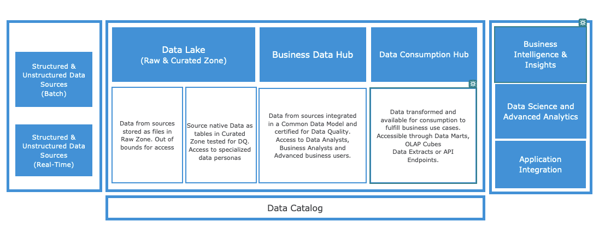

# Objective 
To outline Data Platform Layer principles which, if committed to, will help understand and standardize the way data is organized within each layer of data platform of D&A.

# Scope
The scope of the Data Platform Layer principles is for entire D&A platform starting from data lake to data consumption hub.

# Definition of Each Layer

# Principles for Data Lake - Raw Data Layer​

- **Format** : The data, the structure of the data and the format of the data delivery in the Raw layer should be in the Source Native Format.

- **Transformations**: No transformations should be performed while extracting data from source into the Raw Layer. Only re-assembly of data structures is permissible. ​

- **Requirement Agnostic**: Extraction of data into Raw Data layer should be agnostic of requirements and should be extracted fully without filtering out any entity or attribute​.

- **Agreement with Source**: Data Service Agreement should be put in place, with the source system owner, for data extracted from sources into Raw Layer.​

- **Access**: Raw Data Layer is out of bounds for access by any personas. The data is accessible only for the Data applications moving data from raw to curated layer. ​

- **Data Classification**: Data should be classified for sensitivity,ownership and criticality in the raw data layer and follow the FAIR (Findable, Accessible, Interoperatable and Reuse)principle for business use.

- **Life Cycle Management**: History of the data should be maintained using the data lifecycle management (Hot to cold to archive) enforced by the retention policy defined by data owner.​

- **Data Versioning**: All the versions of the data will be maintained in the Raw Layer, unless a domain specific restriction. 

- **Data Quality** : Configurable dataset (file) level quality checks should be performed in raw data layer and exceptions should be reported back to the source. ​

- **Data Latency** : Latency of data in Raw Layer from Sources should match the needs of the business use cases with flexbility of switching the configuration between batch and real-time.

# Principles for Data Lake - Curated Data Layer​
- **Format** : The data in the Curated Data layer should be stored in the Source Native Format and the data model should be a replica of the source system. ​

- **Transformations**: No transformations or integrations should be performed while moving data from Raw Data Layer to Curated Data Layer . ​

- **Requirement Agnostic**: Availability of data in the Curated Data layer should be agnostic and independent of requirements and the data from a source should be loaded completely without filtering out any entity or attribute or data.​

- **Agreement with Consumer**: Data Consumption Agreement should be put in place, with the consumer party, for data access from Curated Layer for cross domain.​

- **Access**: The data is accessible for the Data applications moving data from curated layer to Business data layer. Access to the curated layer must be given only to personas like Data Scientist or Advanced data analysts in-line with the Access management approach defined by the Data Governance framework in RFC.​

- **Data Masking**: Follow the principle of Privacy and Security by design with all the sensitive data masked and access to unmasked data only in line with the Access principle. 

- **Data Classification**: Data should be classified for sensitivity,ownership and criticality in the and should be accessible only to advanced data personas. ​

- **Life Cycle Management**: History of the data should be maintained within the Curated layer as per the mechanism defined by the source. Data should either be Archived or deleted only in-line with a business or compliance requirement. ​

- **Data Quality** : Data and metadata in the Curated layer should be assessed using a configuration driven  DQ framework but any DQ issues should be reported back to and fixed in the source.
  
- **Data Versioning**: All the versions of the data will be maintained in the Curated Layer, unless a domain specific restriction. 

- **Schema Enhancements**: Only system columns should be added to the data on-boarded into the curated layer from source to support auditing requirements in case of issues and any business enhancements to the data should be avoided. ​

- **Schema Evolution and Enforcement**: Curated layer should be able to support both Schema Enforcement and Schema Evolution. 

# Principles for Business Data Hub
- **Format**: The data from multiple sources in the Business Data layer should be integrated and stored in common data model defined per domain. ​

- **Transformations**: Data transformations, to integrated and store data in the common data model should be performed while moving data from Curated Data Layer to business data layer and should be limited to enrichment with reference data and transformations needed across domains and use cases. ​

- **Metadata Format**: The metadata corresponding to the data in the Business Data layer should be stored in accordance with the common data model.  ​

- **Requirement driven data availability**: Availability of data from curated to business layer should be, preferably but not limited to, driven by a business use case. ​

- **Requirement agnostic mapping of curated to business layer**: Whenever possible, the data mapping from curated to business layer should be done proactively and should be requirement agnostic. Priority should be, however, given to the mapping for the requirements of a business use case. ​

- **Consumption and sharing agreement**: Data should be shared only from the business layer of D&A platform and domains must agree not to distribute data further to other domains. ​Sharing of data should happen only when approved by the Data Owner. 

- **Virtual Data Sharing**: Data from the Business Data Hub should be shared, as much as possible, virtually and not in form of physical extracts through Data Engineering pipelines. ​

- **Access**: The data is accessible for the Data applications moving data from Business data layer to Analytical Data layer. Data should be accessible to personas like Data Scientists, Advanced data users as well as Data Analysts in compliance with the access management framework within RFC.​

- **Data Masking**: Follow the principle of Privacy and Security by design with all the sensitive data masked and access to unmasked data only in line with the Access principle. 

- **Data Classification**: Data should be classified for sensitivity in the Business data layer in accordance with the Data Governance framework within RFC. ​

- **Life Cycle Management**: Business lifecycle of the data should be maintained in the Business Data Layer and History of the data should be maintained unless there is a business or compliance requirement to archive or delete the data. ​

- **Data Versioning**: All the versions of the data will be maintained in the Curated Layer, unless a domain specific restriction.

# Principles for Data Consumption Hub - Analytical Data Layer
- **Format**: The data  in the Analytical Data layer should be stored in the format viable for the business use case and can either be, but not limited to, a de-normalized or normalized extract or dimensional model. ​

- **Transformations**: Data transformations only relevant to a business use cases should be performed while moving data from Business Data Layer to analytical data layer.​

- **Requirement Specific**: Availability of data in the Analytical Data layer from Business data layer must be driven only by a business use case. ​

- **Data Sharing**: Data Sharing between Analytical layers must be avoided and any requirements of the Analytical data layer should only be fulfilled from the business layer. ​

- **Access**: The Data in the Analytical Data layer is accessible to data personas like Advanced data analysts, business analysts or end business users either through SQL editor or though PowerBI reports and should be accessed in accordance with the access management framework within RFC. ​

- **Data Masking**: Follow the principle of Privacy and Security by design with all the sensitive data masked and access to unmasked data only in line with the Access principle. 

- **Data Classification**: Data should be classified for sensitivity in the Analytical data layer in accordance to the Data Governance framework within RFC. ​

- **Life Cycle Management**: Business lifecycle of the data should be maintained in the Analytical Data Layer and History of the data should be maintained unless there is a business or compliance requirement to archive or delete the data. ​

- **Virtual Data Sharing**: Data from the Analytical Data Layer should be shared, as much as possible, virtually and not in form of physical extracts through Data Engineering pipelines. ​

- **Data Quality**: On demand functional data quality checks should be done on the data in the Analytical Data Layer using the configuration driven DQ Engine within the D&A Platform. 