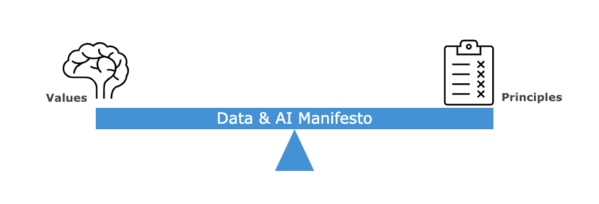
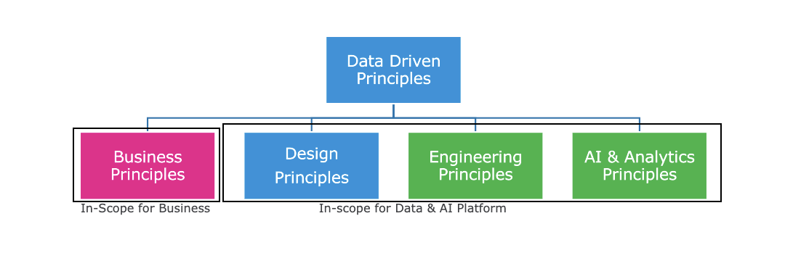

# Objective
To outline the values and principles, which if committed to, will help the organization build an effective Modern Data Platform with a flexible approach and collaboration between Business & IT.​

# What is the Data & AI Manifesto ? 

Data & AI Manifesto highlights the values and principles which will help our organization drive the ambition and vision towards becoming a Data Driven organization. ​

Data driven values act as the foundation for data driven principles which influence the action of various actors in the organization and hence it is very important to strike the right balance between values and principles. ​

# Data Driven Values for Organization​

- **Value** Driven by ensuring that outcomes with tangible business benefit are prioritize. Right Set of data for right set of personas at right latency and at right time.  ​

- ​**Diversity & Variety** – Increase the business value by maximizing data points from varied relevant sources and establish collaboration between various Data users. ​

- **Evolve & Improve** – Maximize value of Data platform by remaining flexible for changes in the business climate to ensure a positive evolution of the delivered value by constant exploration of the Data assets. ​

- **Be Responsible** by inculcating the culture of ethics and transparency and taking accountability for the data issues. ​

# Data Driven Principles 
Data driven principles form the core of the framework to build a Data Driven platform which is fully in line with the values laid down for a Data centric organization. ​

We define principles for Business, Design, Engineering and Advanced Analytics which has to be adopted by the various teams in their way of working to fulfill the ambition and vision of converting Data into a strategic asset. ​

# Business Principles
- Data is owned by Business and thus as Business Asset. IT plays a role of custodian in this case. The Data team supports the business by providing all the data needed to make decisions, build insights or perform advanced analytics.  ​
  
- Data Quality is identified as early in the chain and is ALWAYS fixed at the source. ​
  
- Data is collected at the right latency and supported with access and availability of high quality, self-describing metadata which is ensured by the Data Owner and supported by IT Asset Owner.
  
- Data has an SLA which is supported by Data Quality, Data Observability and data Downtime monitors in the Data Platform and Data Owner is responsible and accountable for this.
  
- Data literacy and a data use culture among Data citizens with access to data and tools to access the data with proper control in place to enable data democratization. ​
  
- Business value of a use case has to be defined by the Data Owner which can be tracked as a KPI for ROI of the data platform.​

# Design Principles 
- Azure Native and Azure First SaaS over IaaS and PaaS over package first to be followed while selecting a tool for a Business use case around Data & Analytics. ​

- We have one Enterprise Data & Analytics platform to support the analytical and reporting Data needs of all Business Units and personas. ​

- Protect the privacy and security of sensitive elements represented in our data by design supported by data labelling & classification. ​

- Data is integrated as whole within data lake without filtering of relevant entity and shared with dependent objects​

- Support democratization of data using open API’s and tool agnostic connection to the platform without impacting the performance of platform​

- Virtual Sharing of data over replication to support the needs of cross domain data needs. ​

- Data Quality anomalies, complemented with observability, for critical data elements is assessed in the Data platform however always fixed at source. ​

- Reproducible and extensible Data product is delivered by design.​

- Enable self-service Data & Analytics Platform, for business to unlock potential of the data, by design. ​

 